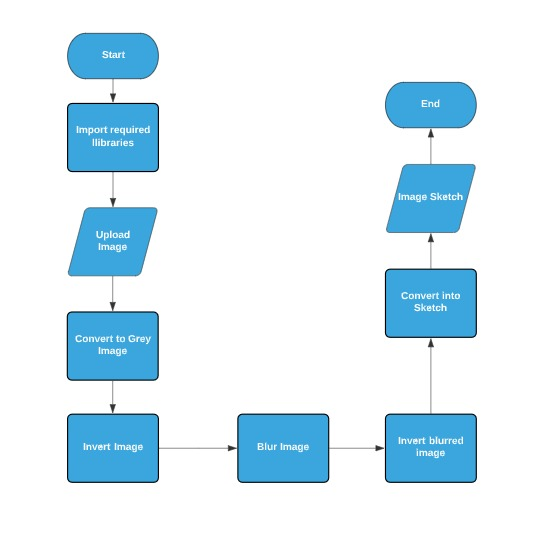

## UCS757 Building Innovative Systems
## Project 1
# Making a Sketch for an image with OpenCV in Python.
Here our objective is to transform images into corresponding sketches using openCV

### Following are the steps I followed to convert image into cartoon
1. Importing the libraries required.
2. Requesting an image from user to make its sketch
3. Converting image to Grey Image
4. Inverting the Image
5. Blurring image
6. Inverting Blurred Image
7. Converting into sketch
8. Saving the sketch

### Input Image                                                                       
 

### Output Image
 

### Live Link
https://sketch-navi.herokuapp.com/

### Flowchart
 

## Submitted by :- 
### Navpreet Singh Kapoor
### 101803293
### COE14
